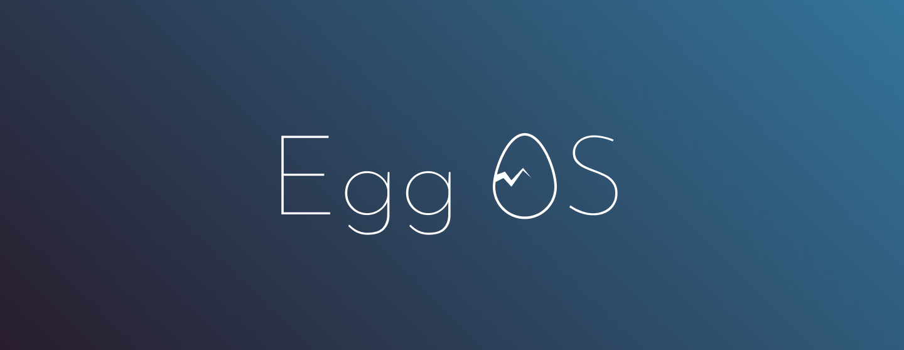

It's a repository for **a joke app** called EggOS.

## Technology

- WebComponents
  - LitElement
- React
- Elm
- Vue
- Unity

### WebComponents

We use WebComponent as a general framework.  
The basic components that make up a Desktop, such as Dock and Window, are WebComponent.

### React

In React, a notepad app has been created.

### Elm

In Elm, a calculator app has been created.

### Vue

In Vue, a reversie app has been created.

### Unity

In Unity, a simple game has been created.

